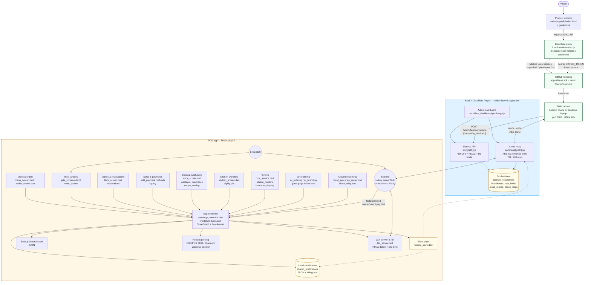

# Order Flow

[](https://github.com/juttjathol/Order-Flow-V2/releases/latest)
[](https://github.com/juttjathol/Order-Flow-V2/actions/workflows/build-release.yml)
[](#how-the-shop-works)
[](https://jathol.org/guide)
[](https://jathol.org/download)

Offline-first multi-device POS for restaurants, retail, fast food, and services, plus a Cloudflare license dashboard.

- **Android app** (`flutter_app/`) — Main server + Order Taker / Kitchen / Cashier / Driver
- **Windows Main** — the same Main server in `order_flow.exe` for Windows 10/11 laptops (v1.1.89+)
- **SaaS dashboard** (`cloudflare_dashboard/`) — customers, keys, device bind / reset / revoke, plans & per-key feature access, push broadcasts
- **APK + Windows ZIP** — create a GitHub Release tag `v1.1.89` (or any `v*`) and the Action attaches `app-release.apk` (+ `app-release.aab`) and `order-flow-windows.zip`
- **Public website** (`website/`) — Jathol.pages.dev + full user guide (`/guide`)

Version **1.1.89+87**.

You only need two things after this repo is on GitHub:

1. Connect the repo to **Cloudflare Pages** (dashboard clicks, no terminal)
2. Create a **GitHub Release** with tag `v1.0.0` (the Action builds the APK + Windows ZIP)

---

## 1. Deploy the SaaS dashboard (Cloudflare website only)

1. Open [Cloudflare Dashboard](https://dash.cloudflare.com) → **Workers & Pages** → **Create** → **Pages** → **Connect to Git**.
2. Select the `juttjathol/Order-Flow-V2` repo.
3. Set:
   - **Project name:** `order-flow-saas`
   - **Production branch:** `main`
   - **Root directory:** `cloudflare_dashboard`
   - **Build command:** leave empty
   - **Build output directory:** `public`
4. **Save and Deploy**.
5. **D1 database**
   - Workers & Pages → **D1** → **Create database** named `order_flow`
   - Open the database → **Console**
   - Paste everything from [`cloudflare_dashboard/schema.sql`](cloudflare_dashboard/schema.sql) and run it
   - Back on the Pages project → **Settings** → **Bindings** → **Add** → **D1 database**
     - Variable name: `DB`
     - Database: `order_flow`
6. **Secrets** (Pages project → **Settings** → **Environment variables** / **Secrets**, Production):
   - `ADMIN_PASSWORD` — dashboard login password
   - `ADMIN_SECRET` — long random string used to sign admin sessions
7. **Retry deployment** so the binding and secrets apply.
8. Open `https://order-flow-saas.pages.dev` (or your Pages URL), sign in, create a customer, generate a license key.

In the Android app license screen, set **License API URL** to that Pages origin.

### License API

`POST /api/v1/license/validate`

```json
{ "licenseKey": "OF-XXXX-XXXX-XXXX-XXXX", "deviceId": "uuid-from-the-phone" }
```

First success **binds** the device. A second device is rejected until you click **Reset device**. Delete or revoke the key and the Main app locks to WhatsApp **@Jathol_Jutt**.

### Plans & per-key access (v1.1.89+, hardened v1.1.89)

Every key carries a **plan** — Starter / Customize / Full — plus the **business models** it may run and a **16-extra feature checklist** (QR ordering, station printers, loyalty, refunds, purchases, cloud sync, branded QR page, third-party channels …) editable from the dashboard's **Access…** dialog:

- **Starter — RM 79** — 12 pro features (everything except QR ordering, cloud sync, branded QR page & third-party channels). Add QR & cloud when you need them.
- **Customize — Let's talk** — all 16 features (QR, cloud, branded QR & third-party included) + bespoke support.
- **Legacy Growth** — same as Starter (12) for existing keys.
- **Full** — everything on, always (the contract; `[]` can never lock a full key out).

A Key's plan lands on the shop's Main at the next online check (every ~15 min), or instantly when someone taps **More → License → Refresh plan & features** in the app, then propagates to every station over LAN. The worker heals any empty-feature row written for a paid plan (v1.1.89 dashboard bug signature) — saving zero extras on Growth/Custom/Full falls back to the plan preset instead of locking a shop out.

---

## 2. Get the APK + Windows ZIP — publish a GitHub Release tag

GitHub Actions (`.github/workflows/build-release.yml`) installs Java 17 + Flutter stable, patches the Android and Windows builds, and attaches **`app-release.apk`** (Android) and **`order-flow-windows.zip`** (Windows 10/11 Main, portable — unzip and run `order_flow.exe`) to the Release.

After that, every release is tag-only (no terminal):

1. Open the repo → **Releases** → **Draft a new release**
2. **Choose a tag** → type `v1.0.0` → **Create new tag** on `main`
3. Title: `Order Flow 1.0.0`
4. **Publish release**

Refresh the Release page after the Action finishes (Actions tab → **Build Release APK + Windows**).

The website's download proxy (`/download`) always serves the latest release — homepage links never go stale.

Every push to an `arena/**` branch also runs analysis and tests, so changes are verified green before they reach a release tag.

---

## How the shop works

One device is **Main**. It holds the license and runs the local server on **port 8787** — an Android phone **or a Windows laptop** (`order_flow.exe` from the release ZIP; see guide §27).

Other phones on the **same Wi‑Fi** tap **Connect to Main** (IP or QR). They do **not** need a key.

After the first online activation, Main works **offline for 48 hours**. When the internet returns it rechecks the key. Transient hiccups (server busy, rate-limited, signature check glitch, maintenance pages) never lock a working shop — only a deleted, revoked or expired key does, and that Main **locks** to WhatsApp **[@Jathol_Jutt](https://wa.me/Jathol_Jutt)**.

Currency is configurable (default `Rs`) and is used on **every** price. Nothing is hardcoded as `$`.

### License binding

| Event | Result |
| --- | --- |
| First Main device activates a key | Bound to that device |
| Second device uses the same key | Rejected until **Reset device** |
| Admin deletes or revokes the key | Main app locks |
| Offline after a valid check | Works 48 hours |
| Plan edited on the dashboard | Main picks it up in ≤15 min, or instantly via **Refresh plan & features** |

### Secondary devices (no key)

License screen → **Connect to Main** → same Wi‑Fi → IP or QR from Main → Home → pick a role:

- Restaurant: Order Taker, Kitchen, Cashier, Driver
- Retail: Cashier, Stock clerk
- Fast food: Order Taker, Kitchen, Cashier
- Services: Front desk, Specialist, Cashier

**Drivers** pair once, then set free / busy / offline even off the shop Wi‑Fi. No SaaS login.

### Cloud networking (Custom plan)

When the shop Wi‑Fi dies mid-service, stations can ride an **encrypted cloud relay** instead of the LAN (v1.1.89+): Main opens a room, stations join with a pairing code, and orders reach Main over any connection. Messages are end-to-end encrypted between your devices, deleted on read, and expire in ~30 minutes — **shop data is never backed up to the cloud**.

---

## Architecture — how it all connects



> **Shop data lives on Main only.** Cloud relay is transit (ciphertext, deleted on read, 30m expiry). SaaS never stores orders.

### Every feature — what it does

| # | Key | Gated | What it does |
|---|-----|-------|--------------|
| 1 | `multi_terminal` | Growth+ | Main is the server on `:8787`; stations join free via IP/QR on same Wi-Fi or via cloud relay on mobile data. Role-based (`manager / orderTaker / kitchen / cashier / driver / stockClerk / frontDesk / specialist`), offline queue, live sync. |
| 2 | `station_printers` | Growth+ | Every station can pick its own printer (ESC/POS `9100` / Bluetooth / Windows spooler), independent of Main. Tested per-station top-bar icon. |
| 3 | `qr_ordering` | Growth+ | Guests on shop Wi-Fi open `http://<main-ip>:8787/order` → pick table, build cart, submit. Orders arrive as `channel: qr` tickets, kitchen auto-fires, price is computed on Main (guest cannot set price). Per-table `24/h` + shop `900/h` flood caps. |
| 4 | `loyalty` | Growth+ | Customers in `customer_display_screen.dart` earn points on paid orders automatically; points show on shared receipts. |
| 5 | `split_payment` | Growth+ | One sale → two tenders (cash / card / wallet / other + `complimentary`). Each leg printed separately. |
| 6 | `refunds` | Growth+ | Paid orders can be refunded → stock returns, ledger entry, receipt reprint. |
| 7 | `customer_display` | Growth+ | Any screen becomes a giant animated total (secondary display) — `customer_display_screen.dart`. |
| 8 | `reservations` | Growth+ | Table reservations with time slots, front-desk view, conflict checks — `reservations`. |
| 9 | `recipe_costing` | Growth+ | Link products to stock ingredients (`recipe` on `upsertProduct`), auto margin & food-cost — `StoreGuard.sanitize` drops recipe when not entitled. |
| 10 | `wastage` | Growth+ | Log waste (`logWastage` / `deleteWastage`) with reason, affects stock and reports. |
| 11 | `purchases` | Growth+ | Suppliers + purchase orders (`upsertSupplier / Purchase / receivePurchase / cancelPurchase`), stock-in on receive. |
| 12 | `advanced_reports` | Growth+ | Sales, best/slow movers, profit, staff performance, 86 board, charts — gated reports. |
| 13 | `eighty_six` | Growth+ | Long-press dish on order screen → 86 (mark unavailable) grey-out everywhere instantly. |
| 14 | `cloud_sync` | **Customize/Full only** | Encrypted relay at `order-flow-v2.pages.dev/api/cloud` — Main `open` room (256-bit id, 6-char code), stations `join` via mobile data, `send`/`pull` AES-GCM, `200` row cap, `1.2s` hot / `30s` idle, member-only write. Shop data never backed up. |
| 15 | `qr_branding` | **Customize/Full only** | Brand the guest page (`qr_brand` editor): shop name, tagline, address, phone, WhatsApp, hours, welcome, accent — `QrBrand` in `order.html`. |
| 16 | `third_party` | **Customize/Full only** | Manual third-party channel log — Foodpanda, GrabFood, ShopeeFood & other. Record the total from the tablet; reports split by channel. |
| — | *Starter* | — | 12 pro features, gated extras off (QR, cloud, branded QR, third-party are Customize add-ons). |
| — | *Customize* | — | All 16 extras, hand-picked per key from dashboard **Access…** dialog. |
| — | *Full* | — | Everything on, always (`[]` can never lock it — `healFeatures` + `allOn` contract). |

*Plan lands on Main at next online check (`5 min` `kRevalidateMinutes`) or instantly via **More → License → Refresh plan & features** (`Plan synced · n/15`), then fans out to all stations over LAN.*

---

## Main app tabs

1. **Home** — server, IP + QR, sales, open orders, charts, broadcasts from the dashboard
2. **Tables / Register / Queue / Appointments** — live table map with busy clocks and search (free / ordered / ready)
3. **Menu** — photos + currency prices; **Menu Scan** imports a menu from a photo or PDF entirely on-device
4. **Stock** — cards, low-stock, auto-deduct on paid orders, suppliers & purchase orders, wastage log, recipe costing
5. **More** — bill profile, printers, drivers, reports & shift close, backup, license & plan extras, language, theme

Kitchen **ready** notifies every Order Taker and Main. English + Urdu. Dark / light green theme.

Printing is network ESC/POS on **TCP 9100**, Bluetooth (Classic + Low-Energy), or — on Windows Main — any installed **Windows printer** (USB thermal works with the built-in *Generic / Text Only* driver). **Every station can use its own printer** (printer icon in the station top bar), independent of Main. A **cash drawer** (RJ11 kick port on the receipt printer) opens automatically on cash payments only; card / wallet / other never open it. Payments support **split tender** (two methods on one sale), receipts can be **shared on WhatsApp/SMS**, paid orders can be **refunded** (stock returns), saved customers earn **loyalty points** automatically, and any screen can become a **customer display** with a giant animated total. Backup is JSON export / import.

The full walkthrough lives on the website: **https://jathol.org/guide** (English + Urdu).

---

## Support

WhatsApp **@Jathol_Jutt** (username, not a phone number): [wa.me/Jathol_Jutt](https://wa.me/Jathol_Jutt)
